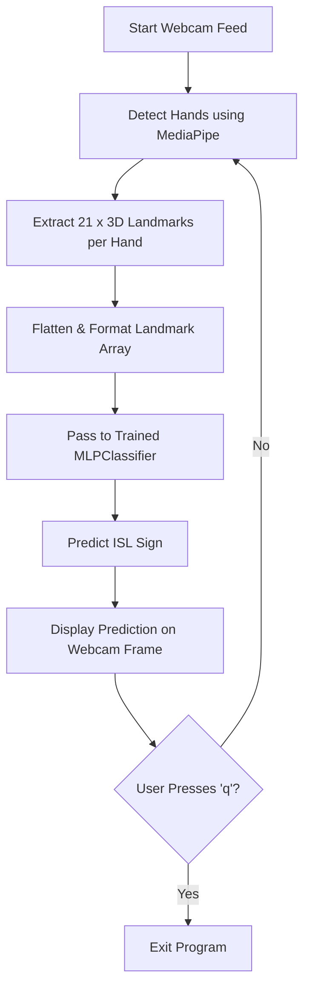

# 🧠 Indian Sign Language (ISL) Detector — Real-time with MediaPipe & MLP

A real-time hand gesture recognition system for **Indian Sign Language**, using:

- 🖐️ **MediaPipe** — for efficient 2-hand landmark extraction  
- 🤖 **Scikit-learn's MLPClassifier** — for gesture classification  
- 🎥 **OpenCV** — for webcam video feed and display  

🚀 Built to predict **ISL alphabets (A–Z)** and **digits (0–9)** using just your webcam!

---

## 📊 Workflow Overview

### 🚀 How It Works
1. 📹 Landmark Data Collection (extract_landmarks.py)
Opens the webcam and detects hands using MediaPipe.

For each frame:

Extracts up to 2 hands, each with 21 landmarks (x, y, z).

Flattens the 3D coordinates → single array (63 per hand → 126 total for 2 hands).

Saves landmarks + label (A-Z, 0-9) into a CSV (isl_landmarks_2hands.csv).

This creates your training dataset.

2. 🧠 Model Training (train_landmark_model.py)
Loads the landmark CSV.

Encodes labels (like 'A' → 0, 'B' → 1, etc.).

Uses MLPClassifier (Multilayer Perceptron) for classification.

Input: 126 features (2 hands × 21 landmarks × 3 dimensions).

Output: Predicted character/digit.

Optionally uses K-Fold Cross Validation for robustness.

Saves the model (isl_landmark_model_2hands.pkl) and label encoder (label_encoder.pkl).

3. 🔮 Real-time Inference (infer_webcam.py)
Starts webcam and uses MediaPipe to extract landmarks live.

Predicts the sign by:

Extracting and formatting landmark data.

Feeding it into the trained classifier.

Decoding the output label.

Displays result (character + confidence score) on-screen.

Runs until you press q.

🧪 Example Output
"Pred: A (97.5%)" ✅

"Pred: 5 (90.1%)" ✋

Or → "No hand detected" if none found

⚠️ Notes & Tips
Ensure consistent distance from camera and good lighting for best accuracy.

Each sign should be clearly visible and distinct.

You need around 1000+ samples per class for stable accuracy.

✅ Features
📦 Lightweight (no deep CNNs, runs smoothly on CPU)

✌️ Dual-hand support (useful for two-handed signs like "R" or "M")

🔁 Real-time feedback with high FPS

🧠 Fully offline (no API or cloud required)

